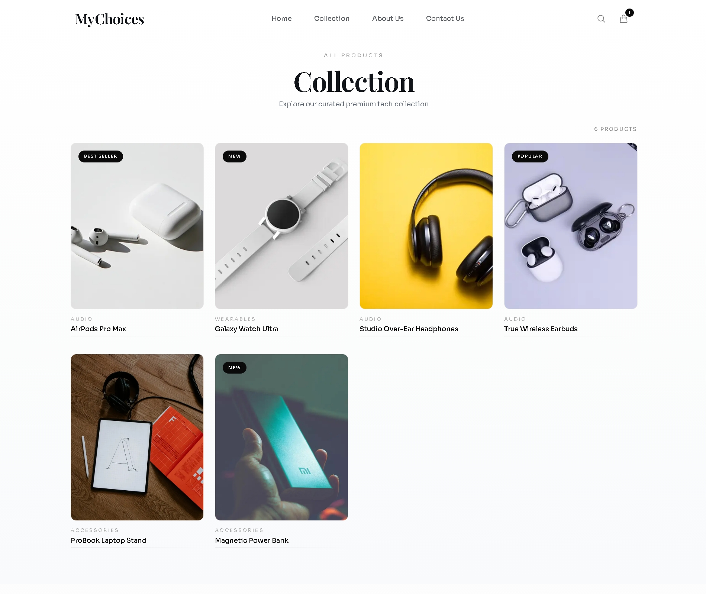
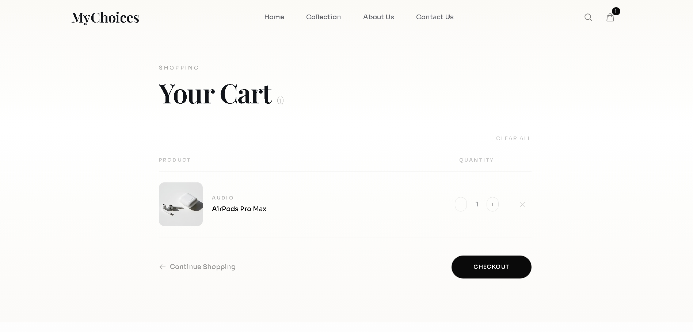

#  MyChoices – Full-Stack E-commerce Application

MyChoices is a full-stack e-commerce web application built with Next.js and TypeScript. It includes a complete backend using API routes, database integration with Prisma, and core e-commerce functionalities such as authentication, cart management, and order handling.

---

## Overview

This project demonstrates a modern full-stack architecture using Next.js App Router, combining frontend UI and backend APIs in a single codebase. It focuses on scalability, clean structure, and real-world e-commerce workflows.

---

```Live Demo"
(https://my-choices-lovat.vercel.app/cart)
```

##  Tech Stack

* **Framework:** Next.js (App Router)
* **Language:** TypeScript
* **Database:** Prisma ORM
* **Backend:** Next.js API Routes
* **State Management:** React Context API
* **Styling:** CSS

---

##  Features

###  Authentication

* User registration and login
* Protected user session (`/api/auth/me`)
* Auth middleware for secured routes

###  Products & Categories

* Product listing and detail pages
* Category-based filtering
* Dynamic routes for products

###  Cart System

* Add/remove items from cart
* Global cart state using Context API
* Backend cart handling via API

###  Orders

* Create and manage orders
* Fetch order details
* Order API integration

###  Contact

* Contact form with backend handling

---

##  Project Structure

```id="k21x8a"
src/
 ├── app/                # Next.js App Router (pages & API routes)
 │   ├── api/            # Backend API endpoints
 │   ├── cart/           # Cart page
 │   ├── collection/     # Product listing
 │   ├── product/[id]/   # Product details
 │
 ├── components/         # Reusable UI components
 ├── lib/                # Context & utilities
 ├── server/             # Services, DB, middleware
 │   ├── services/       # Business logic
 │   ├── db/             # Prisma connection
 │   └── middleware/     # Auth middleware
 │
prisma/
 ├── schema.prisma       # Database schema
 └── seed.ts             # Seed data
```

---

## ⚙️ Getting Started

### 1. Clone the repository

```bash id="a82k2l"
git clone https://github.com/rixavvvvv/MyChoices.git
cd MyChoices
```

### 2. Install dependencies

```bash id="p29x8s"
npm install
```

### 3. Setup environment variables

Create a `.env` file based on `.env.example`:

```env id="z82k3l"
DATABASE_URL=your_database_url
JWT_SECRET=your_secret_key
```

### 4. Setup database

```bash id="m29x1s"
npx prisma migrate dev
npx prisma db seed
```

### 5. Run the development server

```bash id="x91k2s"
npm run dev
```

---

## 📸 Screenshots

###  Home


###  Collection



###  Cart



---

##  API Endpoints (Highlights)

* `/api/auth/register` – Register user
* `/api/auth/login` – Login user
* `/api/products` – Get products
* `/api/cart` – Manage cart
* `/api/orders` – Handle orders

---

##  Key Learnings

* Full-stack development using Next.js App Router
* API design and backend structuring
* Database modeling with Prisma
* State management using React Context
* Authentication & route protection

---

##  Future Improvements

* Payment integration (Stripe/Razorpay)
* Admin dashboard
* Product reviews & ratings
* Deployment (Vercel + DB hosting)

---

##  Contact

* GitHub: https://github.com/rixavvvvv

---
